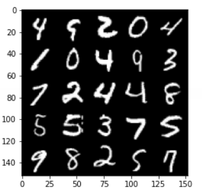

# GAN_VAE_MNIST

This Project Implements two well-known generative methods called GAN & VAE on MNIST dataset. Some generated results are shown for each method.

## Method 1: Generative Adversarial Network

## Method 2: Variational autoencoder

